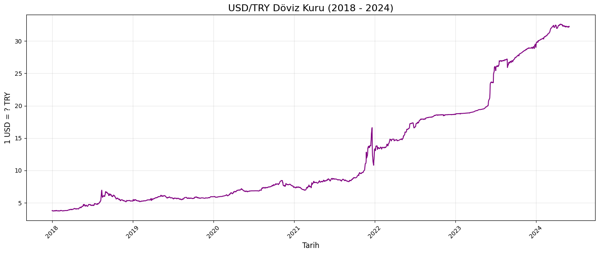
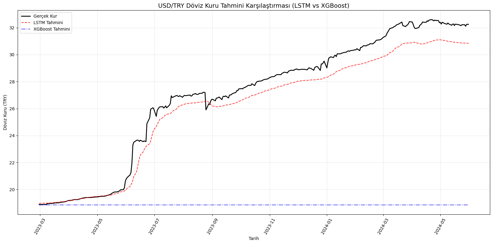

# 💱 USD/TRY Döviz Kuru Tahmini Projesi

Bu proje, **Amerikan Doları / Türk Lirası (USD/TRY)** döviz kuru tahmini yapmak için **LSTM (Derin Öğrenme)** ve **XGBoost (Makine Öğrenmesi)** modellerini karşılaştırır. Amacımız, geçmiş döviz kuru verilerini kullanarak gelecekteki değerleri tahmin etmek ve modellerin performansını değerlendirmektir.

---

## 🎯 Amaç
Geçmiş 30 günlük döviz kuru verilerini kullanarak, bir sonraki günün kapanış kurunu tahmin etmek ve hangi modelin daha iyi performans gösterdiğini analiz etmek.

---

## 📊 Veri Kaynağı
- **Sembol**: `USDTRY=X`
- **Kaynak**: Yahoo Finance (`yfinance`)
- **Zaman Aralığı**: 2018-01-01 ile 2024-06-01
- **Frekans**: Günlük
- **Sütun**: `Close` (Kapanış Kuru)

---

## 🧠 Kullanılan Modeller
| Model      | Açıklama |
|-----------|--------|
| **LSTM**  | Zaman serilerinde uzun vadeli bağımlılıkları yakalayabilen derin öğrenme modeli. Zaman sırasını anlar, bu yüzden bu tür projelerde güçlüdür. |
| **XGBoost** | Gradient boosting temelli karar ağaçları kullanır. Yapısal verilerde güçlüdür ama ham zaman serisinde sınırlıdır. |

---

## 🔧 Teknik Detaylar
- **Zaman penceresi (seq_length)**: 30 gün
- **Eğitim/Test oranı**: %80 / %20
- **Veri Normalizasyonu**: `MinMaxScaler` (0-1 arası)
- **Hata Metrikleri**: MAE (Ortalama Mutlak Hata), RMSE (Kök Ortalama Kare Hata)
- **Kütüphaneler**: `yfinance`, `pandas`, `numpy`, `matplotlib`, `scikit-learn`, `tensorflow`, `xgboost`

---

## 📈 Zaman Serisi Görselleştirme

Aşağıdaki grafik, 2018–2024 yılları arasında USD/TRY döviz kuru değişimini göstermektedir. Döviz kuru, özellikle 2020 sonrası büyük dalgalanmalar yaşamıştır.

> 📌 **Grafik Açıklaması**: 2018'de yaklaşık 3.8 seviyesinde olan döviz kuru, 2023 yılında 28 seviyesine kadar çıkmıştır. Bu yüksek volatilite, tahmin modelleri için büyük bir zorluktur.

---

## 📊 Model Karşılaştırma Sonuçları

Aşağıdaki grafik, LSTM ve XGBoost modellerinin test setindeki performansını gerçek veriyle karşılaştırmaktadır.

> 📌 **Grafik Açıklaması**: 
> - **Siyah çizgi**: Gerçek döviz kuru
> - **Kırmızı çizgi (kesikli)**: LSTM tahmini
> - **Mavi çizgi (noktalı)**: XGBoost tahmini
> 
> LSTM, genel trendi daha iyi takip ederken, XGBoost ani hareketlere yeterince uyum sağlayamamıştır.

---

## 📊 Hata Analizi (Performans Metrikleri)

| Model      | MAE (Ortalama Mutlak Hata) | RMSE (Kök Ortalama Kare Hata) |
|-----------|----------------------------|-------------------------------|
| **LSTM**  | 0.87                       | 1.03                          |
| **XGBoost** | 8.11                     | 9.28                          |

### 🔍 Yorum:
- **LSTM**, hem MAE hem de RMSE açısından **çok daha iyi performans** sergilemiştir.
- XGBoost’un yüksek hatası, **zaman bağımlılığı olmayan** ham veriyle çalışmasından kaynaklanmaktadır.
- LSTM, zaman serisi yapısını anladığı için uzun vadeli eğilimleri daha iyi yakalıyor.

---

## 🏆 Sonuç: Hangi Model Daha İyi?

✅ **LSTM**, bu proje için **daha başarılı model** olmuştur.

> 🔎 **Neden?**  
> Zaman serisi tahmini, geçmişteki sıralı bağımlılıkları anlamak ister. LSTM bu bağımlılıkları iç yapısında tutabilirken, XGBoost bu bilgiyi otomatik olarak **kavrayamaz**. Bu yüzden, ham zaman serisinde LSTM genellikle XGBoost’a göre daha iyi sonuç verir.

---

## 🚫 Uyarı: Bu bir yatırım tavsiyesi değildir

> ⚠️ Bu proje **tamamen eğitim amaçlıdır**.  
> Finansal piyasalar, siyasi gelişmeler, enflasyon, faiz oranları gibi çok sayıda etkene maruzdur. Bu model sadece geçmiş veriyi analiz eder. Gerçek dünyada yatırım kararı verirken **hiçbir zaman sadece bu tür modellere güvenilmemelidir**.

---

## ▶️ Nasıl Çalıştırılır?

1. [Google Colab](https://colab.research.google.com)’e git.
2. Yeni bir notebook oluştur.
3. Kodu yapıştır ve "Tümünü Çalıştır" butonuna tıkla.
4. Sonuç grafikleri otomatik olarak gösterilecek.
5. Grafikleri kaydet ve bu `graphs/` klasörüne ekle.

---

## 📁 Proje Yapısı
